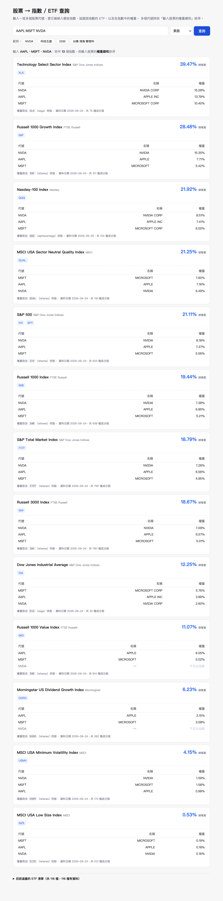
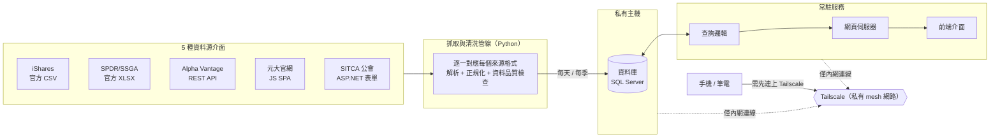
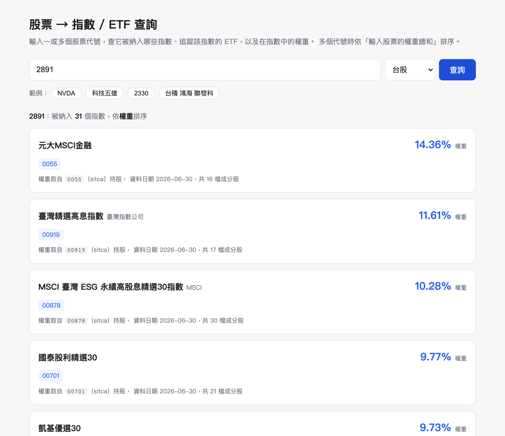
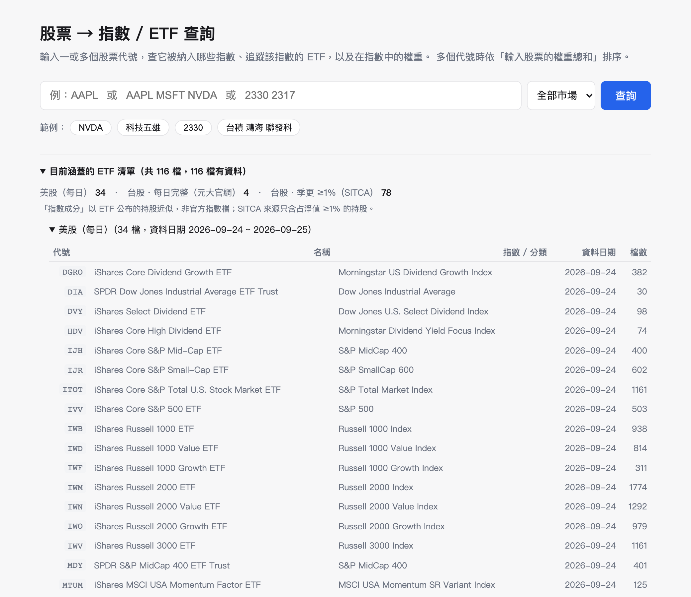

# stock-index-finder

輸入股票代號 → 查它被納入哪些**指數**、追蹤該指數的 **ETF**、以及在指數中的**權重**。
輸入多個代號 → 依「這些股票的權重總和」把指數排序，一眼看出一組持股集中在哪些指數 / ETF。

從發想、資料源評估、到自己動手把整套系統串起來（抓資料 → 資料庫 → 查詢 → 網頁），
每天自動更新，手機、筆電隨時能查。



## 動機

做指數／因子投資研究，常需要回答「這檔股票對我手上這組 ETF 的整體曝險貢獻有多大」，
或「這幾檔重疊的 ETF 到底共同壓在哪些指數上」——但市面上沒有一個地方能直接查這件事，
真正的官方指數成分股是 S&P、MSCI、FTSE 這些指數公司賣的專有付費資料，一般人拿不到。

這個專案的做法：用 **ETF 每天／每季公布的持股資料當作指數成分的替代（proxy）**，把美股
主要指數家族（S&P、Russell、MSCI 因子指數、GICS 類股…）跟台股近百檔股票型 ETF 兜起來，
做成「輸入一或多檔股票、看它們共同曝險在哪些指數 / ETF、佔多少權重」的查詢工具。

## 這個專案展示什麼

- **資料源評估與取捨**：不同來源（發行商官網、公會揭露、第三方 API）在更新頻率、完整度、
  取得門檻上差很多——例如台股公會資料是季更、只揭露占淨值 ≥1% 的持股，跟每日完整持股是
  不同等級的東西。這個決定該用哪個、涵蓋率要拉到多少才夠用，是自己評估後拍板的。
- **對資料品質保持懷疑**：官方下載連結會悄悄失效、資料檔偶爾會是空的、不同來源同一檔股票
  的代號寫法不一樣——做了好幾層自動檢查（權重加總是否接近 100%、資料是否過期、
  抓到的基金名字對不對），抓錯資料寧可保留舊的也不要覆蓋。
- **系統思維，不是寫完就丟著**：資料庫刻意架在私有主機、只透過 VPN 存取（見下方說明），
  每天定時自動更新、資料放多久自動清理，前端可以從任何裝置查詢。
- **上線後主動追蹤、抓出問題**：排程換架構後曾經默默失敗連續 6 天沒人發現（前端看起來一切
  正常，只是資料是舊的）——是自己回頭比對資料日期才抓出來，修完後也把「各項資料多久沒更新」
  直接攤在網頁上，之後一眼就能看出資料有沒有卡住。

## 架構



### 為什麼查不到公開的線上 demo

**資料庫刻意不對公網開放。** SQL Server 跑在一台私有 VM 上，前端跑在 Mac mini，兩者只透過
[Tailscale](https://tailscale.com/)（點對點私有網路）互連——沒有對外開放的 port，也沒有
公開網址。這是刻意的資安設計，不是還沒做完：資料庫這種本來就不該暴露在公網上的東西，
不會因為「只是個人專案」就放寬。想看實際畫面請看下面的截圖，或聯絡我做現場展示。

## 截圖

| 多代號查詢（依權重總和排序） | 台股查詢 | ETF 涵蓋清單（可展開） |
|---|---|---|
|  |  |  |

## 涵蓋範圍

目前約 **34 檔美股 + 82 檔台股 ETF**。

- **美股**（`config/etfs.yaml`，每日）：S&P 500/400/600、S&P Total Market、
  Russell 1000/2000/3000（含 growth/value 切分）、Nasdaq-100、道瓊、
  11 個 GICS 類股（SPDR）、MSCI USA 五大單因子、幾個股息指數。
  → 大中型股通常命中 6–13 個指數；小型股透過 Russell 2000 / S&P 600。
  → **沒收錄**：等權重(RSP)、ESG、主題型、國際/新興市場、IVW/IVE、Vanguard CRSP 系列。
- **台股**：
  - **元大 0050 / 0051 / 0056 / 00713**：官網爬蟲，**每日、完整持股**。
  - **其餘 ~80 檔國內股票型 ETF**：SITCA 基金投資明細（`indexfinder sync-tw` 自動對應 TWSE 代號），
    **季更、只含占淨值 ≥1% 的持股**（集中型 ETF 涵蓋 ~90–98%，大盤型 ~50–85%）。

要擴充美股：`config/etfs.yaml` 加一列（iShares 只填產品頁網址的數字 id）。
台股會在 `sync-tw` 時自動補進 `config/tw_etfs.generated.yaml`。

## 這是什麼、不是什麼

- **「指數成分」是用 ETF 每日公布的持股（holdings）近似的**，不是 S&P / MSCI / FTSE / 臺灣指數公司的官方指數檔——那些是要付費的專有資料。
- 一個「指數」底下可能有多檔 ETF（例如 S&P 500 有 IVV、SPY）。權重取自 config 標記為 `primary` 的那一檔。
- 只涵蓋 `config/etfs.yaml` 裡的 ETF。沒有被任何清單內 ETF 持有的股票會查不到。

## 安裝

```bash
cd stock-index-finder
uv sync                          # 基本功能（美股 + 元大以外的來源）
uv sync --extra browser          # 需要 headless 瀏覽器的來源（元大、被擋的 Invesco）
uv run playwright install chromium

cp .env.example .env             # 填入你自己的 SQL Server 連線資訊
```

**資料庫是 SQL Server，不是本機檔案。** 我自己的部署放在一台私有 VM 上（跟另一個研究專案
共用同一台伺服器、不同 schema），只透過 Tailscale 連，不對公網開放（見下方「架構」）。
你要跑起來的話，指到你自己能連到的任何 SQL Server 即可——本機、VM、雲端都行。

> ⚠️ 如果 `fetch`/`serve` 是用 launchd 常駐跑的：第一次連 VM 的私有網段 IP，macOS 可能會用
> 「本機網路（Local Network）」隱私權限卡住背景程式（互動式終端機不受影響，容易誤判成「沒問題」）。
> 症狀是 log 裡有 `pyodbc.OperationalError: Login timeout expired`。
> 系統設定 → 隱私權與安全性 → 本機網路，把 Terminal / Python 打開允許。
> `db.py` 也內建連線重試（5 次、間隔 5 秒）、`daily-fetch.sh` 開頭會等網路通了再跑，
> 但這兩個都只能扛暫時性問題，扛不住權限被擋。

## 使用

```bash
# 1. 抓資料（第一次 / 每天更新一次）
uv run indexfinder fetch --browser          # 全部；--browser 讓元大能抓
uv run indexfinder fetch --market US         # 只抓美股（不需 browser）
uv run indexfinder fetch --only IVV QQQ      # 只抓特定幾檔

# 2. 開網頁介面
uv run indexfinder serve                     # 只有本機 http://127.0.0.1:8000
uv run indexfinder serve --lan               # 同網路的手機/其他電腦也能連（會印出 IP）

# 其他
uv run indexfinder status                    # 看每檔 ETF 的資料狀態 / 日期
uv run indexfinder query AAPL MSFT --market US   # 命令列查詢，輸出 JSON
uv run indexfinder sync-tw                    # 重新產生台股 ETF 自動對應清單
uv run indexfinder prune                      # 手動清過時資料 + 壓縮 DB
```

### 從任何地方查（Tailscale，常駐）

```bash
bash scripts/install-serve.sh            # 開機自動啟動、掛掉自動重啟，綁 Tailscale IP
bash scripts/install-serve.sh --uninstall
```

裝好後：**手機/其他電腦連上 Tailscale → 開 `http://<Mac 的 Tailscale IP>:8000`**。
Mac 的 Tailscale IP：Tailscale app 裡看，或 `/Applications/Tailscale.app/Contents/MacOS/Tailscale ip -4`。

- 只綁 Tailscale 介面，**不會對校網公開 IP 曝露**。
- Mac 睡眠沒關係（喚醒後自動恢復）；Mac 關機就連不到 → 要真 24/7 得放 VM / 雲端。
- log：`data/serve.log`

**只在同一個 Wi-Fi 用**（不透過 Tailscale）：`uv run indexfinder serve --lan`

> ⚠️ 專案不能放在 `~/Desktop` / `~/Documents` / `~/Downloads`——macOS 會擋 launchd 存取這些資料夾。目前放 `~/stock-index-finder`。

### 台股 ETF 自動對應

`sync-tw` 會抓 SITCA 全部國內股票型 ETF（~84 檔），用 TWSE 的代號↔簡稱清單 fuzzy 對應，
寫進 `config/tw_etfs.generated.yaml`（勿手動改；同代號以 `etfs.yaml` 為準）。
`fetch` 在該檔不存在或超過 30 天時會自動先跑一次。對不上的（名稱差太多的傘型基金）
印在輸出裡，補到 `src/indexfinder/sources/sitca.py` 的 `_ALIAS`。

SITCA 是季資料、隔季才更新，所以 `fetch` 對這些 ETF 會**自動判斷有沒有新的一季**，
沒有就跳過（顯示「已最新」）；要強制重抓加 `--refresh`。

### 每天自動更新（launchd）

```bash
bash scripts/install-schedule.sh          # 每天 08:00
bash scripts/install-schedule.sh 7 30      # 改成 07:30
bash scripts/install-schedule.sh --uninstall
```

裝好後每天早上自動跑 `fetch --browser` + `prune`，log 在 `data/fetch.log`（超過 2MB 自動截斷）。
**排程是無聲失敗的**——出問題只會躺在 log 裡，網頁看起來一樣能查（只是資料舊了）。
偶爾看一下 `uv run indexfinder status` 的資料日期，或 log 有沒有連續好幾天報錯。

### 空間管理

- DB 每檔 ETF 只留**最近 2 次**抓取，更舊的連同 holdings 一起刪。
- `data/raw/` 每檔 ETF 只留**最近 2 份**原始下載檔（`fetch --keep-raw N` 可調，`--keep-raw 1` 最省）。
- config 移除某檔 ETF 後，它的舊資料會在下次 `fetch` 或 `prune` 時清掉。
- 手動清理 + 壓縮 DB：`uv run indexfinder prune`
- 穩定後總佔用約 **15–20 MB**（DB ~1MB + raw ~16MB），不會隨時間膨脹。

## 資料來源

| 來源 | ETF | 方式 | 需要 browser |
|---|---|---|---|
| `ishares` | IVV, IJH, IJR, ITOT, IWB/M/V/F/D/N/O, MTUM, QUAL, USMV, VLUE, SIZE, DGRO, HDV, DVY | `.../products/<id>/x/latest-holdings.csv` | 否 |
| `ssga` | SPY, MDY, DIA, XLB/C/E/F/I/K/P/RE/U/V/Y | `holdings-daily-us-en-<t>.xlsx` | 否 |
| `invesco` | （備用，目前沒有 ETF 用）| 官方每日 CSV；資料中心 IP 常被 Akamai 擋（406） | 有時 |
| `alphavantage` | QQQ | `ETF_PROFILE` API，完整持股 + 權重 | 否 |
| `yuanta` | 0050, 0051, 0056, 00713 | SPA 頁面點「展開」後讀表格（每日、完整） | **是** |
| `sitca` | 其餘 ~80 檔國內股票型台股 ETF | 投信投顧公會「基金投資明細」（季更、≥1% 持股） | 否 |
| `manual` | 任何抓不到的 | 讀 `data/manual/<TICKER>.csv` | — |

- 抓下來的原始檔案都保留在 `data/raw/<ETF>/<日期>__<抓取時間>.csv`。
- `fetch` 會做健檢：持股數、權重加總是否接近 100%、資料是否過期，異常顯示 `WARN`。
- iShares 每個 ETF 只認 `product_id`（產品頁網址 `/products/<id>/` 的數字）。config 裡的 `expect_name` 會擋掉填錯 id 抓到別檔的情況。
- **Alpha Vantage**：預設用 `demo` key（QQQ 剛好在其白名單，免申請即可用）。要抓別的美股 ETF 或提高額度，
  去 [alphavantage.co](https://www.alphavantage.co/support/#api-key) 免費申請 key（25 次/天），
  設環境變數 `ALPHAVANTAGE_API_KEY` 或 config 裡該 ETF 加 `params.av_key`。

### 已知限制

- **台股 SITCA 資料是季更 + 只有占淨值 ≥1% 的持股**。要每日 / 完整持股：0050 系列已用元大官網爬蟲；其餘要靠 TEJ「基金週持股」或「寄送完整持股」匯出放 `data/manual/`。
- SITCA 有 2 檔對不上 TWSE 代號（中信上櫃ESG30、新光半導體30），暫未涵蓋。
- 偶爾 iShares 會短暫提供空持股檔（0 檔）→ `fetch` 拒絕、保留舊資料，下次自動修復。
- 爬蟲依賴各網站 DOM / ASP.NET 結構，改版就要修對應的 `sources/*.py`。

## 查詢邏輯

**單一代號**：列出每個包含它的指數，欄位是該股在指數中的權重，依權重排序。

**多個代號**：對每個指數，加總「輸入代號中、有在該指數的」權重，依總和排序；並列出各代號個別權重、哪些代號不在該指數。

代號正規化：美股去掉交易所後綴、`BRK.B` = `BRKB`；台股取開頭 4~6 碼數字。打中文名（「台積電」）會用持股名稱反查代號。

## 專案結構

```
config/etfs.yaml            ETF ↔ 指數 對應表（要加 ETF 改這裡）
.env                        SQL Server 連線資訊（不進版控，複製 .env.example）
src/indexfinder/
  sources/                  各發行商的抓取 + 解析 adapter
  fetch 在 cli.py           抓取 orchestrator + 健檢
  query.py                  單 / 多代號查詢邏輯
  dbconfig.py               讀 .env、組 pyodbc 連線字串
  db.py                     SQL Server（VM 上，schema etf_finder；snapshots + holdings，每檔留最近 2 版）
  server.py                 FastAPI，/api/lookup /api/etfs /api/health
web/                        單頁前端（純 HTML/JS）
data/raw/                   保留的原始下載檔（本機，跟資料庫分開）
tests/                      pytest（不連真實 DB：query 用 fake repo、parser 用 tests/fixtures）
```

**用 SQL 直接查**（SSMS / Azure Data Studio，接 `.env` 裡同一個連線）：
```sql
SELECT * FROM etf_finder.latest_holdings WHERE ticker = '2330' ORDER BY weight DESC;
SELECT etf_ticker, as_of_date, COUNT(*) n FROM etf_finder.latest_holdings GROUP BY etf_ticker, as_of_date;
```

## 測試

```bash
uv run --extra dev pytest -q
```

---

用 Python + SQL Server + 一個原生網頁前端搭起來，常駐在私有網路上跑。

## License

[MIT](LICENSE)
