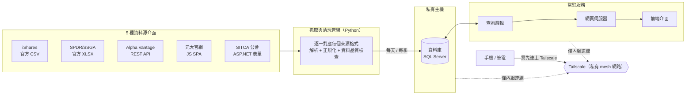

# Weight of Stocks in Index Finder

[](https://github.com/jerrylin0205/weight-of-stocks-in-index-finder/actions/workflows/tests.yml)
[](LICENSE)


輸入股票代號，查它被納入哪些**指數**、追蹤該指數的 **ETF**、以及在指數中的**權重**。
輸入多個代號則依「權重總和」排序，看這組股票共同曝險在哪些指數上。

一個人從資料源評估到系統串接（抓資料 → 資料庫 → 查詢 → 網頁）全部包辦，每天自動更新。


## 目錄

- [動機](#動機)
- [這個專案展示什麼](#這個專案展示什麼)
- [架構](#架構)
- [截圖](#截圖)
- [涵蓋範圍](#涵蓋範圍)
- [安裝](#安裝)
- [使用](#使用)
- [資料來源](#資料來源)
- [查詢邏輯](#查詢邏輯)
- [專案結構](#專案結構)
- [測試](#測試)
- [License](#license)

## 動機

指數／因子投資研究常要回答「這檔股票對我這組 ETF 的曝險貢獻多大」或「這幾檔重疊的 ETF
共同壓在哪些指數上」，但真正的官方指數成分股是 S&P、MSCI、FTSE 賣的專有付費資料，一般人
拿不到。這個專案用 ETF 每日／每季公布的持股當替代（proxy），把美股主要指數家族（S&P、
Russell、MSCI 因子指數、GICS 類股）跟台股近百檔股票型 ETF 兜起來做查詢。

## 這個專案展示什麼

- **資料源取捨**：發行商官網、公會揭露、第三方 API 在更新頻率跟完整度上落差很大，自己評估
  後決定哪個來源配哪些 ETF、涵蓋率拉到多少才算夠用。
- **資料品質意識**：官方連結會悄悄失效、資料檔偶爾是空的，做了多層自動檢查（權重加總、
  資料日期、基金名稱比對），寧可保留舊資料也不覆蓋成錯的。
- **完整的系統，不是寫完就丟著**：資料庫架在私有主機、只透過 VPN 存取，每天定時更新、
  舊資料自動清理，任何裝置都能查。
- **上線後持續追蹤**：排程曾經默默失敗連續 6 天沒人發現，自己比對資料日期抓出來後，把各項
  資料的更新日期直接攤在網頁上，之後一眼就能看出有沒有卡住。

## 架構



資料庫跟前端只透過 [Tailscale](https://tailscale.com/) 互連，沒有對外開放的 port 或公開
網址——資料庫本來就不該暴露在公網上，這是刻意的資安設計。想看實際畫面請看截圖，或聯絡我
現場展示。

## 截圖

| 多代號查詢（依權重總和排序） | 台股查詢 | ETF 涵蓋清單（可展開） |
|---|---|---|
|  |  |  |

## 涵蓋範圍

目前 **116 檔 ETF**（34 檔美股 + 82 檔台股），全部都有資料。指數成分是用 ETF 公布的持股近似，不是官方指數檔（那是
付費專有資料）；一個指數可能對到多檔 ETF（例如 S&P 500 有 IVV、SPY），只涵蓋清單內的 ETF。

- **美股**（每日）：S&P 500/400/600、S&P Total Market、Russell 1000/2000/3000（含
  growth/value）、Nasdaq-100、道瓊、11 個 GICS 類股、MSCI USA 五大單因子、幾個股息指數。
  沒收錄：等權重、ESG、主題型、國際/新興市場、Vanguard CRSP 系列。
- **台股**：元大 0050/0051/0056/00713 每日完整持股；其餘約 80 檔國內股票型 ETF 用投信公會
  的季度揭露（只含占淨值 ≥1% 的持股），代號用 fuzzy matching 自動對應 TWSE 官方清單。

擴充美股：`config/etfs.yaml` 加一列。台股新增會在跑 `sync-tw` 時自動補進。

## 安裝

```bash
cd stock-index-finder
uv sync                          # 基本功能
uv sync --extra browser          # 需要 headless 瀏覽器的來源（元大等）
uv run playwright install chromium
cp .env.example .env             # 填入你自己的 SQL Server 連線資訊
```

資料庫是 SQL Server，不是本機檔案。我自己部署在一台私有 VM 上，只透過 Tailscale 連；
你要跑起來的話指到任何自己能連到的 SQL Server 即可（本機、VM、雲端都行）。

> 用 launchd 常駐跑的話，第一次連 VM 私有網段 IP，macOS「本機網路」隱私權限可能會擋住
> 背景程式（互動式終端機不受影響，容易誤判成沒問題），症狀是連線逾時。系統設定裡把
> Terminal/Python 打開允許即可。連線也內建重試機制。

## 使用

```bash
# 抓資料（第一次 / 每天更新一次）
uv run indexfinder fetch --browser
uv run indexfinder fetch --market US         # 只抓美股，不需 browser
uv run indexfinder fetch --only IVV QQQ      # 只抓特定幾檔

# 開網頁介面
uv run indexfinder serve                     # 本機 http://127.0.0.1:8000
uv run indexfinder serve --lan               # 同網路其他裝置也能連

# 其他
uv run indexfinder status                    # 各 ETF 的資料狀態 / 日期
uv run indexfinder query AAPL MSFT --market US
uv run indexfinder sync-tw                    # 重新產生台股 ETF 對應清單
uv run indexfinder prune                      # 清過時資料 + 壓縮 DB
```

**從任何地方查**（Tailscale 常駐）：

```bash
bash scripts/install-serve.sh            # 開機自動啟動、掛掉自動重啟，綁 Tailscale IP
```

裝好後手機/筆電連上 Tailscale，開 `http://<Mac 的 Tailscale IP>:8000` 即可，Mac 睡眠沒
關係，關機才連不到。只在同一個 Wi-Fi 用就跑 `serve --lan`。

> 專案不能放在 `~/Desktop`／`~/Documents`／`~/Downloads`，macOS 會擋 launchd 存取這些資料夾。

**每天自動更新**：`bash scripts/install-schedule.sh` 裝一個 08:00 的排程跑 `fetch` +
`prune`，log 在 `data/fetch.log`。排程失敗是無聲的（網頁照常能查，只是資料舊了），偶爾看
一下 `indexfinder status` 的資料日期比較保險。

**空間**：資料庫跟原始下載檔每檔 ETF 只留最近兩份，穩定後總佔用約 15–20 MB，不會膨脹。

## 資料來源

| 來源 | ETF | 方式 | 需要 browser |
|---|---|---|---|
| `ishares` | IVV, IJH, IJR, ITOT, IWB/M/V/F/D/N/O, MTUM, QUAL, USMV, VLUE, SIZE, DGRO, HDV, DVY | 官方 CSV | 否 |
| `ssga` | SPY, MDY, DIA, XLB/C/E/F/I/K/P/RE/U/V/Y | 官方 XLSX | 否 |
| `alphavantage` | QQQ | `ETF_PROFILE` API | 否 |
| `yuanta` | 0050, 0051, 0056, 00713 | 官網頁面（每日、完整） | 是 |
| `sitca` | 其餘約 80 檔台股 ETF | 投信公會季度揭露（≥1% 持股） | 否 |
| `manual` | 任何抓不到的 | `data/manual/<TICKER>.csv` | — |

`fetch` 會做健檢（持股數、權重加總、資料新鮮度），異常會標警告或直接拒絕寫入。

已知限制：SITCA 資料季更且只含 ≥1% 持股，有 2 檔對不上 TWSE 代號；iShares 偶爾會短暫回傳
空檔案，這種情況會保留舊資料不覆蓋。

## 查詢邏輯

單一代號：列出每個包含它的指數，依權重排序。多個代號：對每個指數加總「輸入代號中有在
該指數的」權重，依總和排序，並列出各代號個別權重跟缺席的代號。

代號正規化：美股去掉交易所後綴（`BRK.B` = `BRKB`），台股取開頭 4~6 碼數字，打中文名（如
「台積電」）會用持股名稱反查代號。

## 專案結構

```
config/etfs.yaml            ETF ↔ 指數 對應表
.env                        SQL Server 連線資訊（不進版控）
src/indexfinder/
  sources/                  各發行商的抓取 + 解析 adapter
  cli.py                    抓取 orchestrator + 健檢
  query.py                  查詢邏輯
  dbconfig.py / db.py       SQL Server 連線與 schema
  server.py                 FastAPI
web/                        單頁前端（純 HTML/JS）
tests/                      pytest，不連真實網路或資料庫
```

用 SQL 直接查（接 `.env` 裡同一個連線）：

```sql
SELECT * FROM etf_finder.latest_holdings WHERE ticker = '2330' ORDER BY weight DESC;
```

## 測試

```bash
uv run --extra dev pytest -q
```

## License

[MIT](LICENSE)
